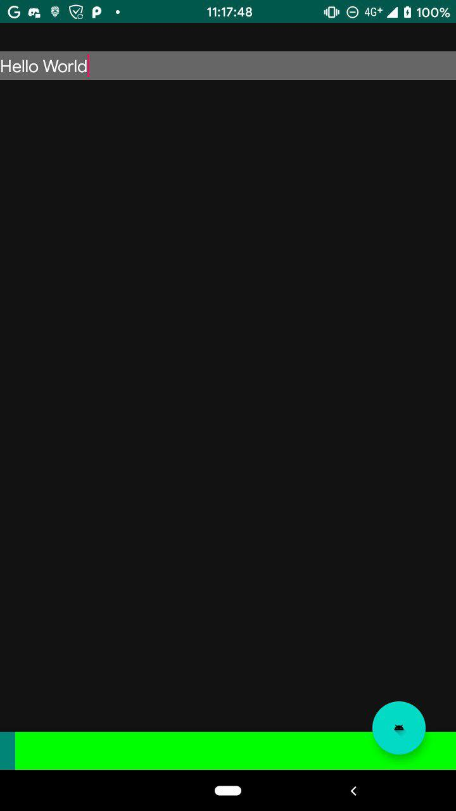
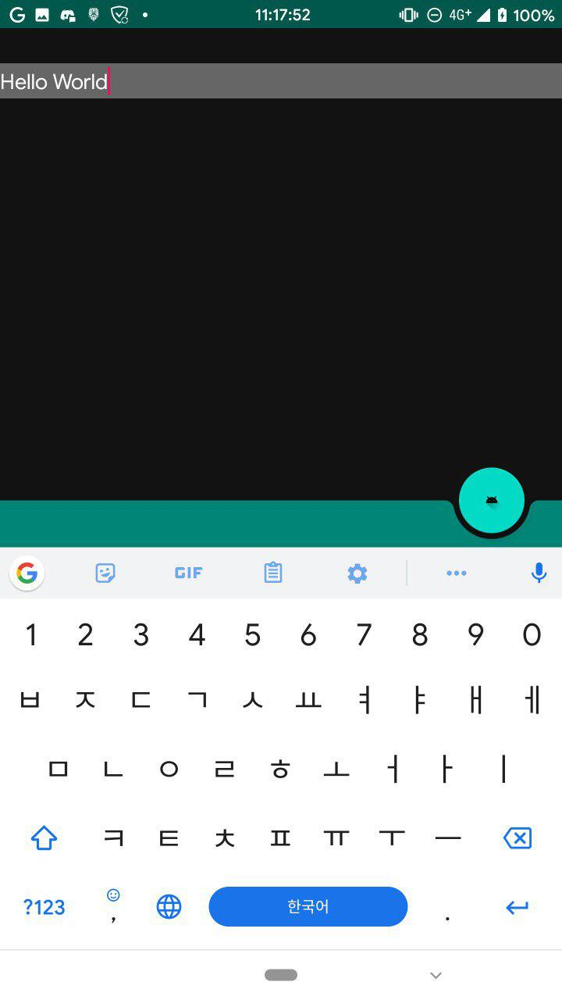

# BottomAppBarBug
Child view disappeared if keyboard is opened
with activity's `android:windowSoftInputMode="adjustResize"` option

After [Make BottomAppBar respect insets for Android Q Edge to Edge support](https://github.com/material-components/material-components-android/commit/1aa712539856b4d41e1cfedf643e0f7039e3e625) commit.

## Screenshot
* Before keyboard open - green is childview


* After keyboard open - green gone :thinking:


## How to fix?
I think it's tempory fix but use internal api to not to respect Q Edge to Edge support
```kotlin
    ViewUtils.doOnApplyWindowInsets(bottomBar, object : ViewUtils.OnApplyWindowInsetsListener {
      override fun onApplyWindowInsets(view: View?, insets: WindowInsetsCompat?, initialPadding: ViewUtils.RelativePadding?): WindowInsetsCompat {
        return insets!!
      }
    })
```